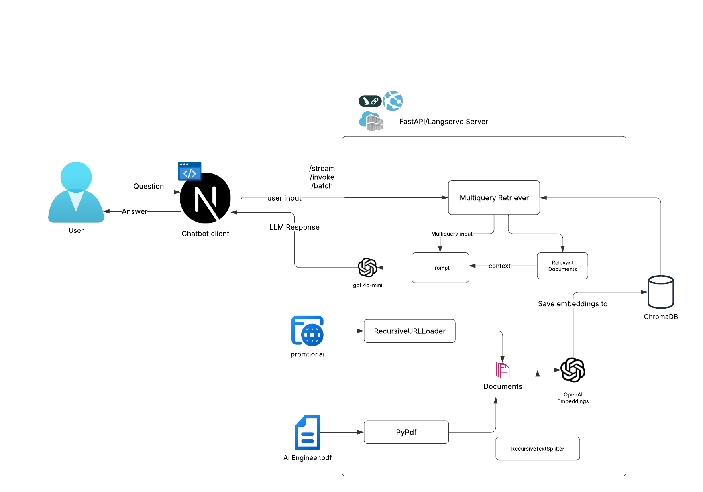

# Promtior Challenge - RAG chatbot API

## Overview
This project is part of a challenge for the AI Engineering position at Promtior.
This is a simple API that uses LangChain to build a RAG chatbot. It uses a combination of a URL loader, a PDF loader, and a vector store to store the data.

There's a client app ([source code here](https://github.com/TomasVilalta/chatbot-client)) that uses the api to build a chatbot interface. It's 
deployed on azure and can be accessed at https://gray-cliff-02203150f.6.azurestaticapps.net/

You can call the api directly at https://promtiot-chatbot-app-gvgyhcedbff2dzcv.canadacentral-01.azurewebsites.net/promtior-chat or [use the playground](https://promtiot-chatbot-app-gvgyhcedbff2dzcv.canadacentral-01.azurewebsites.net/promtior-chat/playground/)

## Local deployment

#### Deploying the server as a docker container (recommended)
1. Clone the repository
2. Create a .env file in the root directory and set the variables as shown in the .env.example file.
3. Build the docker image with

```bash
docker compose up --build
```
Your server will be available at http://localhost:8000

#### Running the server locally
1. Clone the repository
2. Create a .env file in the root directory and set the variables as shown in the .env.example file.
3. Setup your own local virtual environment of choice and install the dependencies with pip

```bash
pip install -r requirements.txt
```
4. Then run the server with

```bash
python src/server.py
```

## Docs
There are [Dev notes](docs/DevLog.md) about the implementation process, challenges encountered, and decisions made.
There's also a [diagram](docs/Diagram.png) that shows the overall flow of the app.




